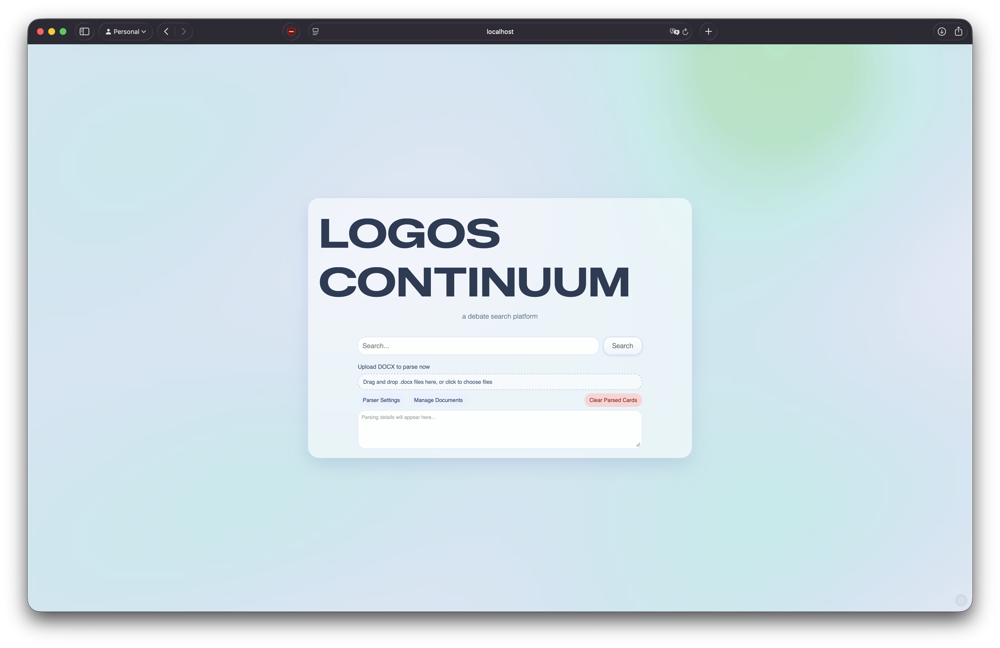
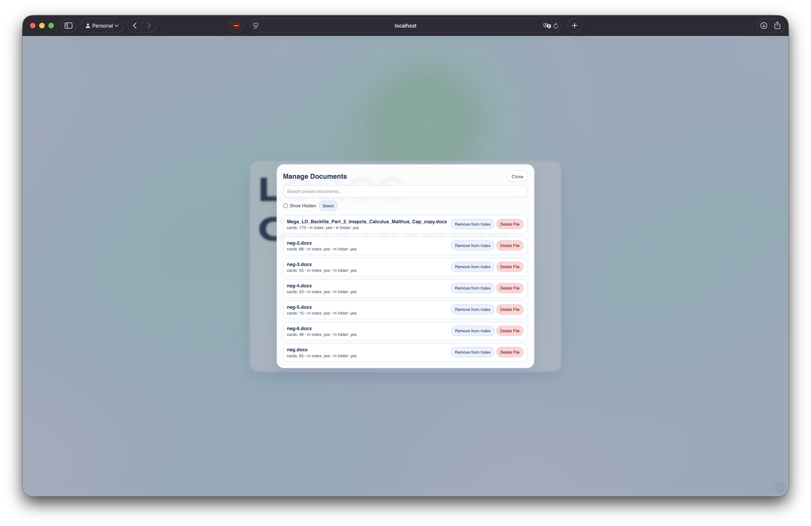
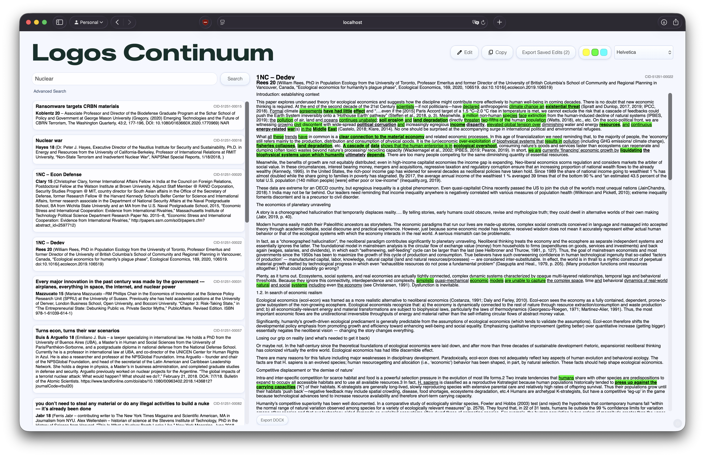
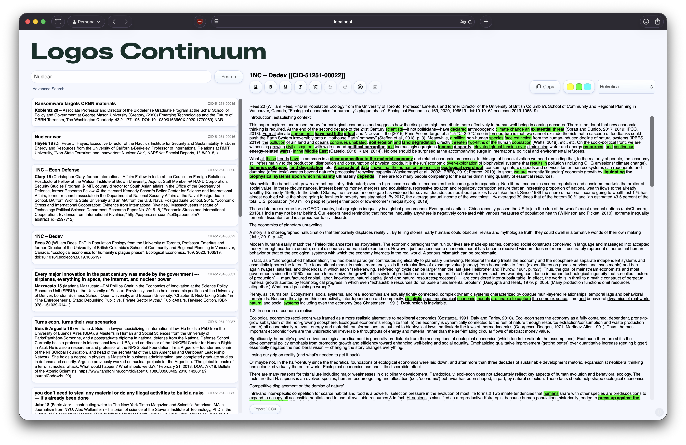

# Screenshots

This page shows how Logos Continuum works in practice.

## Home page

### Upload and parse documents

### Manage indexed/uploaded documents

## Query page

### Search results

### Card detail and editing

---

If any image is missing, add the screenshot file to this same folder using the exact filenames above.
